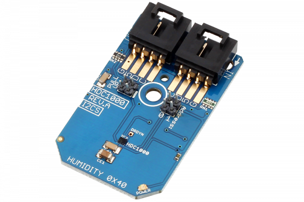

# HDC1000

The HDC1000 is a digital humidity sensor with an integrated temperature sensor that provides excellent measurement accuracy at very low power.The device measures humidity based on a novel capacitive sensor. The humidity and temperature sensors are factory calibrated.
This Device is available from www.ncd.io 

[SKU: HDC1000_I2CS]

(https://store.ncd.io/product/hdc1000-humidity-and-temperature-sensor-%C2%B13rh-%C2%B10-2c-i2c-mini-module/)
This Sample code can be used with Arduino.

Hardware needed to interface HDC1000 sensor with Arduino

1. <a href="https://store.ncd.io/product/i2c-shield-for-arduino-nano/">Arduino Nano</a>

2. <a href="https://store.ncd.io/product/i2c-shield-for-arduino-micro-with-i2c-expansion-port/">Arduino Micro</a>

3. <a href="https://store.ncd.io/product/i2c-shield-for-arduino-uno/">Arduino uno</a>

4. <a href="https://store.ncd.io/product/dual-i2c-shield-for-arduino-due-with-modular-communications-interface/">Arduino Due</a>

5. <a href="https://store.ncd.io/product/hdc1000-humidity-and-temperature-sensor-%C2%B13rh-%C2%B10-2c-i2c-mini-module/">HDC1000 Humidity and Temperature Sensor</a>

6. <a href="https://store.ncd.io/product/i%C2%B2c-cable/">I2C Cable</a>

HDC1000:

The HDC1000 is a digital humidity sensor with an integrated temperature sensor that provides excellent measurement accuracy at very low power.The device measures humidity based on a novel capacitive sensor. The humidity and temperature sensors are factory calibrated.

Applications:

• HVAC

• Smart Thermostats and Room Monitors

• Handheld Meters

• Medical Devices

• Cargo Shipping

• Automotive Windshield Defog

• Wearable Devices

• Mobile Devices

How to Use the HDC1000 Arduino Library
The HDC1000 have number of settings, which can be configured based on user requirements. .

1.Software reset:The following command resets the software.

            hdc.setReset(RESET_DONE);                       // Software Reset

2.Heater enable:The following command is used to enable the heater.

            hdc.setHeaterStatus(HEATER_ENABLE);             // Heater Enable
            
3.Mode selection:The following command is used to select either humidity measurement mode or temperature measurement mode or both measurement mode. 

            hdc.setMode(TEMP_OR_HUMIDITY);                  // Temperature or Humidity is Acquired

4.Voltage setting:The following command is used to set the voltage as HIGH.

             hdc.setVoltage(VOLTAGE_HIGH);                   // Battery Voltage > 2.8V

5.Temperature measurement resolution:The following command is used to set the resolution of temperature as 14Bit.

            hdc.setTempResolution(TEMP_RESOLUTION_14);      // Temperature Measurement Resolution: 14-Bit
            
6.Humidity measurement resolution:The following command is used to set the resolution of humidity as 14Bit.

            hdc.setHumResolution(HUM_RESOLUTION_14);        // Humidity Measurement Resolution: 14-Bit
